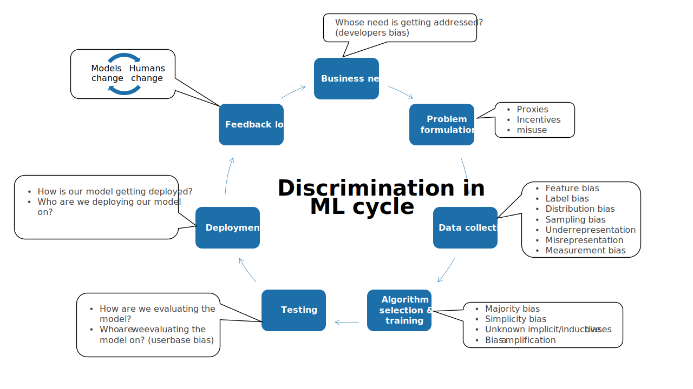

  

[Slides](https://fereshte-khani.github.io/files/ML_cycle_discrimianation.pdf "Slides")

Throughout history, people have been discriminated against based on certain characteristics: women were not allowed to vote because of their sex, Black people were enslaved because of their race, disabled people could not enter some places because of their disability status, and so on. Following the tireless efforts of numerous activists, the United States passed legislation to prevent discrimination based on race, color, religion, sex, national origin, sexual orientation, and gender identity. Although these laws partially prevent discrimination in employment, housing, education, and other areas of social life, it is unclear how to identify and prevent discrimination in machine learning (ML) models. With machine learning having such a profound impact on our daily lives, it is important to better understand discrimination in ML. Below is how bias can creep into the ML cycle at different stages.
 
  - **Business need:** Developers' biases can lead to ML models that only address a particular group's need and ignore other groups, or similarly only cause harm to a specific protected group.
  - **Problem formulation:** A problem formulation for an ML model consists of defining a set of features and a target that needs to be predicted from them. The true need (e.g., if a content is related to the user query) is different from a proxy that is used (e.g., if the user clicked on the content). These proxies might adversely affect a particular group. It is also beneficial to think if this problem formulation can be used to harm some groups.
  - **Data:** ML models learn patterns from previously collected data. The data usually reflect the longstanding discrimination against protected groups. This discrimination can be manifested as
    - *Label bias:* Labels are biased toward one group (e.g., historically well-qualified women did not get hired).
    - *Feature bias:* features are biased toward one group (e.g., number of previous arrests are biased against minorities as it is more probable for them to get arrested with the same amount of illegal drugs),
    - *Distribution bias:* Historical discrimination creates a gap between the distribution of different groups (e.g., There is a gap between the number of men and women in the Senate).
    - *Sampling bias:* data can only be available/sampled from some groups, or data can misrepresent some groups (e.g., consider only hate speech text is available for homosexual people).
  - **Algorithm/Training:**
    - *Majority bias:* ML models usually work for a group that represents the majority of data (e.g., generalization bounds).
    - *Simplicity bias:* ML algorithms tend to find the simplest model which can cause discrimination for a population with a more complicated function.
    - *Inductive/implicit bias:* There are many unknowns about ML models and it is not clear how they affect different groups.
    - *Bias amplification:* It has been shown that ML model might amplify the biases in data.
    - *Misspecification:* Not having the true function in the family can affect different groups differently.
  - **Testing:**
    - *Evaluation metrics:* the metrics that are used for evaluation might not represent some groups (e.g., the average accuracy ignores performance of small groups).
    - *Userbase bias:* The evaluation metric is computed based on the userbase of the model, which can be very skewed toward one group. In addition, the industry also evaluates a system through different rings, and some groups' evaluations enter the system faster than others.
  - **Deployment:** Multiple questions need to be addressed during deployment:
    - Are we deploying our model on a population that we did not collect data from?
    - Are we considering the change in the population over time?
    - Is our model deployed on a task that is not trained for?
  - **Feedback loops:** ML models can change the population and change in the population can change the model in the response and so on. This feedback loop can exacerbate bias and lead to longstanding discrimination that cannot get fixed very easily.
    - *Humans change* their behavior due to the model predictions (e.g., students try to increase their SAT score for admission to the university by studying harder or if they are resourceful taking the exam multiple times and submitting the higher score). Generally, model predictions change the incentives for individuals (e.g., if the probability of arrest is high without committing the crime for one group, members of that group might become incentivized to commit the crime regardless). Models can also alter human behavior more explicitly, especially when a model's predictions for individuals have consequences (e.g., a college-admitted individual goes through training which increases her skill level, or a recommendation system can alter a person’s food choices by recommending many types of junk food).
    - *Models change* over time to fit the population. The common practice of A/B testing in the industry optimizes the model for the current users and may worsen the model over time for protected groups. Although any model that works with its user feedback changes over time accordingly, machine learning makes this process faster by training the models rapidly every few months using the newly collected data.

I'm working on biases in Data and how they interact with biases in the algorithm/training. I'm also interested in understanding testing biases and the feedback loops. Please reach out if you want to chat about these topics.
